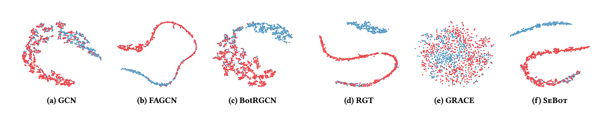

# SEBot
The code for paper "SEBot: Structural Entropy Guided Multi-View Contrastive Learning for Social Bot Detection." on SIGKDD Conference on Knowledge Discovery and Data Mining  2024 (KDD).

# Abstract
  Recent advancements in social bot detection have been driven by the adoption of Graph Neural Networks. The social graph, constructed from social network interactions, contains benign and bot accounts that influence each other. However, previous graph-based detection methods that follow the transductive message-passing paradigm may not fully utilize hidden graph information and are vulnerable to adversarial bot behavior. The indiscriminate message passing between nodes from different categories and communities results in excessively homogeneous node representations, ultimately reducing the effectiveness of social bot detectors. In this paper, we propose SEBot, a novel multi-view graph-based contrastive learning-enabled social bot detector. In particular, we use structural entropy as an uncertainty metric to optimize the entire graph's structure and subgraph-level granularity, revealing the implicitly existing hierarchical community structure. And we design an encoder to enable message passing beyond the homophily assumption, enhancing robustness to adversarial behaviors of social bots. Finally, we employ multi-view contrastive learning to maximize mutual information between different views and enhance the detection performance through multi-task learning.
Experimental results demonstrate that our approach significantly improves the performance of social bot detection compared with SOTA methods.

# Model


  Overview of our proposed framework SeBot, which mainly consists of three modules: 1) Node-level encoding tree
generation and bottom-up message passing; 2) Subgraph-level encoding trees generation and message-passing; 3) Relational
information aggregation beyond homophily. Contrastive learning loss and classification loss are later calculated on obtained
tree types of representations.
# Results


  Performance comparison on TwiBot-20 and MGTAB in terms of accuracy, F1-score, recall and precision. The best and
second-best results are highlighted with bold and underline.’-’ indicates that the method is not applicable to MGTAB due to
lack of unprocessed raw dataset.
# Hyperparameter


  Sensitive analysis of hyperparameter 𝜆1 and 𝜆2 on TwiBot-20.
# Visualization



# Supplementary materials
The relevant datasets and encoding tree files can be downloaded from the following two links respectively:

Datasets: https://rec.ustc.edu.cn/share/06848760-8962-11ef-96b7-0d511309398d

Encoding trees: https://stuscueducn-my.sharepoint.com/:f:/g/personal/un0o7_stu_scu_edu_cn/EhYz2KKKKLVMvDSXPTa2FnEBq9wpQK_56rV-UrxoY-q4HA?e=ZtSKAd

# Citation
```
@inproceedings{yang2024sebot,
  title={SeBot: Structural Entropy Guided Multi-View Contrastive Learning for Social Bot Detection},
  author={Yang, Yingguang and Wu, Qi and He, Buyun and Peng, Hao and Yang, Renyu and Hao, Zhifeng and Liao, Yong},
  booktitle={Proceedings of the 30th ACM SIGKDD Conference on Knowledge Discovery and Data Mining},
  pages={3841--3852},
  year={2024}
}
```
